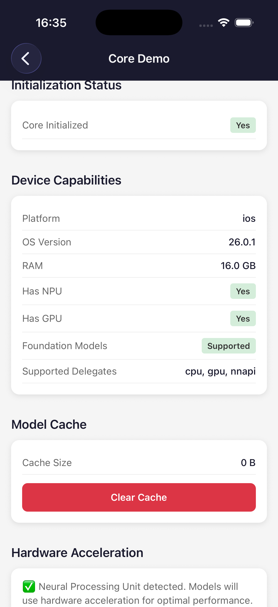
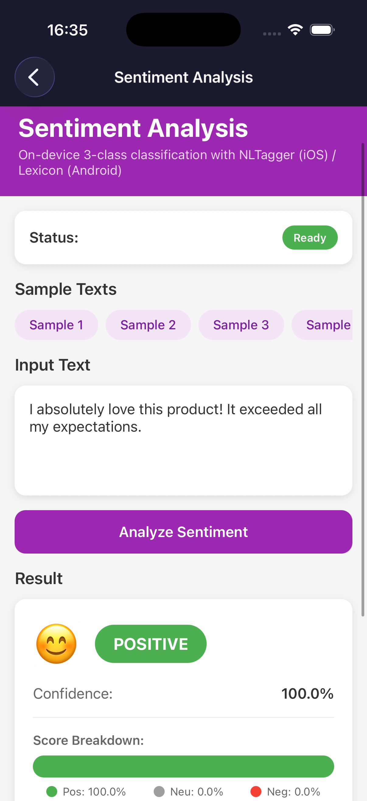
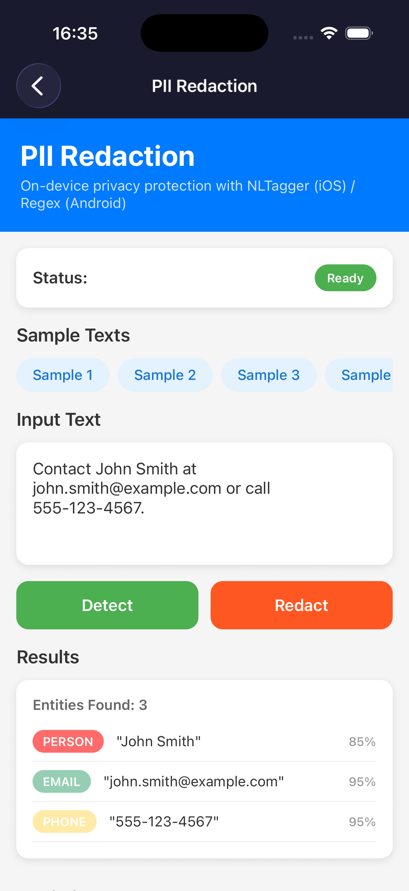
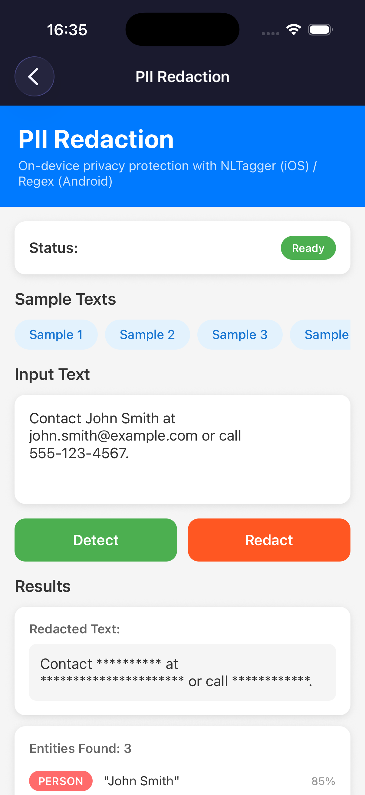
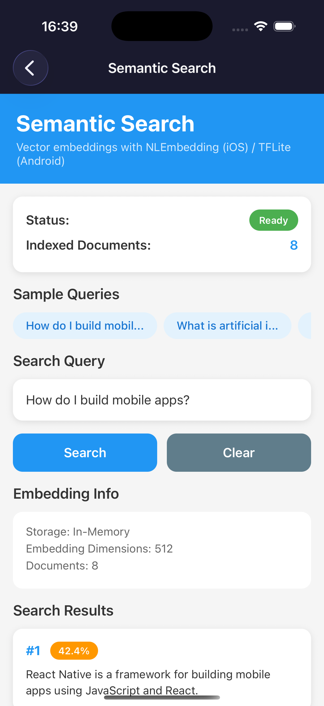
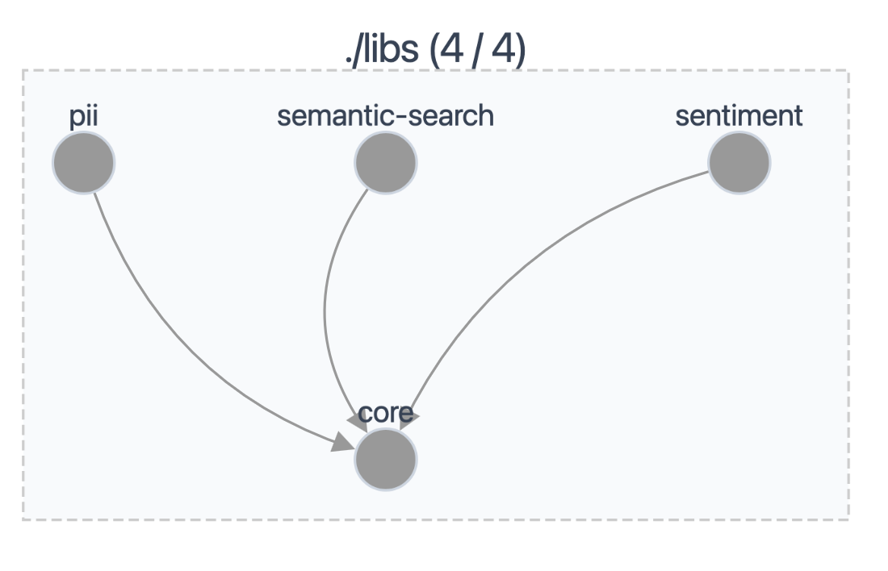

# @local-intelligence

On-device AI for React Native — privacy-first, hardware-accelerated machine learning without cloud dependencies.

## Screenshots

<table>
  <tr>
    <td align="center">
      <br />
      <b>Core Module</b><br />
      <sub>Device capabilities detection, hardware acceleration status, and model cache management</sub>
    </td>
    <td align="center">
      <br />
      <b>Sentiment Analysis</b><br />
      <sub>On-device 3-class sentiment classification with confidence scores and score breakdown</sub>
    </td>
  </tr>
  <tr>
    <td align="center">
      <br />
      <b>PII Detection</b><br />
      <sub>Identify personal information including names, emails, and phone numbers with confidence scores</sub>
    </td>
    <td align="center">
      <br />
      <b>PII Redaction</b><br />
      <sub>Automatically redact sensitive information while preserving text structure</sub>
    </td>
  </tr>
  <tr>
    <td align="center">
      <br />
      <b>Semantic Search</b><br />
      <sub>Vector embeddings with natural language queries and similarity-ranked results</sub>
    </td>
    <td align="center">
      <br />
      <b>Monorepo Structure</b><br />
      <sub>Nx-managed packages with core as the shared dependency for all feature modules</sub>
    </td>
  </tr>
</table>

## Packages

| Package                               | Description                                                  | Size    | Model Size | Status     |
| ------------------------------------- | ------------------------------------------------------------ | ------- | ---------- | ---------- |
| `@local-intelligence/core`            | Native engine, model management, hardware detection          | 9.1 kB  | -          | ✅ MVP     |
| `@local-intelligence/pii`             | PII detection with NLTagger+BERT (iOS) / BERT-ONNX (Android) | 11.1 kB | ~38 MB     | ✅ MVP     |
| `@local-intelligence/sentiment`       | Sentiment analysis: NLTagger (iOS) / Lexicon (Android)       | 9.2 kB  | -          | ✅ MVP     |
| `@local-intelligence/semantic-search` | Text embeddings: NLEmbedding (iOS) / MiniLM TFLite (Android) | 10.5 kB | ~45 MB     | ⚠️ Beta    |
| `@local-intelligence/chat`            | On-device LLM (Foundation Models / ExecuTorch)               | -       | -          | 🚧 Planned |

> **Zero runtime JS dependencies** — all packages rely solely on React Native's native runtime and platform ML frameworks. Models are downloaded on-demand from our CDN (`cdn.localintelligence.dev`).

## Models

Models are hosted on Cloudflare R2 and downloaded automatically when first needed:

| Model            | Package         | Format | Size  | Source                                                                                                  |
| ---------------- | --------------- | ------ | ----- | ------------------------------------------------------------------------------------------------------- |
| `bert-small-pii` | pii             | ONNX   | 38 MB | [gravitee-io/bert-small-pii-detection](https://huggingface.co/gravitee-io/bert-small-pii-detection)     |
| `minilm-l6-v2`   | semantic-search | TFLite | 45 MB | [sentence-transformers/all-MiniLM-L6-v2](https://huggingface.co/sentence-transformers/all-MiniLM-L6-v2) |

> **⚠️ Cross-Platform Note:** iOS semantic-search uses Apple's NLEmbedding (512-dim, adjusted to 384) while Android uses MiniLM-L6-v2 TFLite. Embeddings are **not compatible across platforms** - indexes built on one platform cannot be searched from another.

## Getting Started

### Prerequisites

- Node.js 18+
- React Native 0.76+ (New Architecture required)
- Xcode 15+ (for iOS)
- Android Studio (for Android)

### Installation

```bash
# Clone the repository
git clone https://github.com/local-intelligence/local-intelligence.git
cd local-intelligence

# Install dependencies
npm install

# iOS: Install pods
cd apps/playground/ios && pod install && cd ../../..

# Run the playground app
nx run playground:run-ios
# or
nx run playground:run-android
```

## Development

This is an Nx monorepo with the following structure:

```
local-intelligence/
├── libs/
│   └── core/           # @local-intelligence/core - Native Bridge Module
├── apps/
│   └── playground/     # Demo app showcasing all features
├── nx.json             # Nx configuration
└── package.json        # Root package.json
```

### Commands

```bash
# Build all packages
npm run build

# Run tests
npm run test

# Lint
npm run lint

# Run affected builds only
npm run affected:build

# Release (with conventional commits)
npm run release:dry  # Dry run
npm run release      # Actual release
```

### Conventional Commits

This project uses [Conventional Commits](https://www.conventionalcommits.org/) for semantic versioning.

**Format:** `type(scope): description`

**Types:**

- `feat` - New feature (minor version bump)
- `fix` - Bug fix (patch version bump)
- `docs` - Documentation only
- `style` - Code style (formatting, etc.)
- `refactor` - Code refactoring
- `test` - Adding tests
- `chore` - Maintenance tasks

**Scopes:** `core`, `pii`, `sentiment`, `semantic-search`, `chat`, `playground`, `workspace`, `deps`, `release`

**Examples:**

```bash
git commit -m "feat(core): add device capability detection"
git commit -m "fix(core): handle model download cancellation"
git commit -m "docs(workspace): update README"
```

## Platform Support

| Platform | Minimum Version | Notes                        |
| -------- | --------------- | ---------------------------- |
| iOS      | 15.0            | Core ML, NLTagger            |
| iOS      | 26.0            | Foundation Models (for chat) |
| Android  | API 24          | LiteRT base support          |
| Android  | API 27          | NNAPI acceleration           |

## License

MIT © [Local Intelligence](https://github.com/debrie/local-intelligence)
